# Analyse des salaires dans les métiers de la donnée et de l'IA

**71 913 offres d'emploi × MongoDB, agrégations et MapReduce**

Projet réalisé dans le cadre du cours **Gestion des données avec Hadoop** (IONIS).

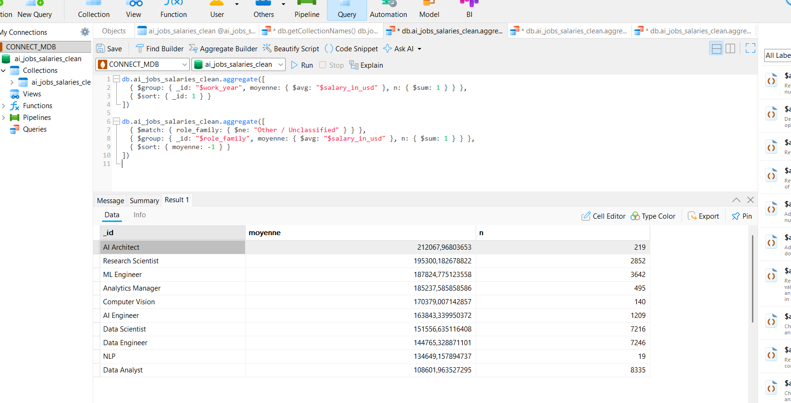

---

## Sommaire

1. [Objectif](#1-objectif)
2. [Résultats clés](#2-résultats-clés)
3. [Architecture](#3-architecture)
4. [Stack technique](#4-stack-technique)
5. [Données sources](#5-données-sources)
6. [Installation et exécution](#6-installation-et-exécution)
7. [Étapes du projet et techniques utilisées](#7-étapes-du-projet-et-techniques-utilisées)
8. [Captures d'écran](#8-captures-décran)
9. [Limites et perspectives](#9-limites-et-perspectives)
10. [Structure du dépôt](#10-structure-du-dépôt)

---

## 1. Objectif

Analyser le marché des emplois en données et en intelligence artificielle à partir d'un jeu de
71 913 offres d'emploi couvrant 2020 à 2025, afin de répondre à trois questions :

- **combien** paie chaque niveau de séniorité, et quelle est la progression d'un niveau à l'autre ;
- **quels métiers** de la donnée et de l'IA sont les mieux rémunérés, à volume comparable ;
- **le télétravail** est-il mieux payé que le présentiel, et si non, pourquoi l'intuition inverse est-elle si répandue.

Le projet met en œuvre une chaîne complète : import du CSV dans MongoDB, nettoyage et enrichissement,
isolation des valeurs aberrantes, agrégations par pipeline, implémentation du paradigme **MapReduce**
avec comparaison chiffrée des deux mécanismes, contrôle qualité et indexation.

---

## 2. Résultats clés

| Indicateur | Valeur |
|---|---|
| Offres d'emploi analysées | **71 913** (2020-2025) |
| Périmètre d'analyse après exclusion des extrêmes | **70 159** documents |
| Salaires aberrants isolés (audit, non supprimés) | **1 754** |
| Intitulés de poste distincts | **422**, regroupés en **11** familles |
| Pays d'implantation des entreprises | **97** |
| Concentration sur le marché américain | **83,6 %** (60 147 offres) |

**Salaire annuel moyen par niveau d'expérience** (extrêmes exclus) :

| Niveau | Moyenne | Médiane | Q1 – Q3 | Effectif |
|---|---|---|---|---|
| Executive-level | 188 040 $ | 183 800 $ | 142 250 – 233 600 $ | 2 638 |
| Senior-level | 160 838 $ | 153 600 $ | 114 108 – 201 100 $ | 36 623 |
| Mid-level | 130 783 $ | 120 000 $ | 85 000 – 166 810 $ | 22 971 |
| Entry-level | 96 019 $ | 85 080 $ | 60 000 – 122 500 $ | 7 927 |

Chaque niveau vaut environ **+25 à +35 %** du précédent, et l'écart Entry → Executive atteint **1,96×**.

**Classement des familles de métiers** (extrêmes exclus, au moins 100 offres) :

| Famille | Moyenne | Médiane | Effectif |
|---|---|---|---|
| AI Architect | 192 781 $ | 185 000 $ | 199 |
| Research Scientist | 177 687 $ | 173 233 $ | 2 642 |
| ML Engineer | 176 789 $ | 171 000 $ | 3 460 |
| Analytics Manager | 168 747 $ | 161 400 $ | 459 |
| Computer Vision | 161 895 $ | 170 000 $ | 134 |
| AI Engineer | 154 529 $ | 147 500 $ | 1 165 |
| Data Scientist | 147 433 $ | 140 109 $ | 7 102 |
| Data Engineer | 141 937 $ | 135 000 $ | 7 168 |
| Data Analyst | 107 661 $ | 99 200 $ | 8 313 |

**Conclusion principale :** le télétravail **ne paie pas mieux** que le présentiel — 145 486 $ en Remote
contre 144 843 $ en On-site, soit un écart de 0,4 % non significatif. L'intuition inverse vient de la
composition des groupes : le croisement avec le niveau d'expérience montre que l'avantage **s'inverse
selon la séniorité** — le présentiel domine en Entry (100 036 $ contre 91 957 $), le télétravail en
Executive (209 472 $ contre 200 462 $). La moyenne globale masque donc deux effets opposés, et
l'effet apparent du mode de travail provient du profil des postes bien plus que du télétravail
lui-même.

---

## 3. Architecture

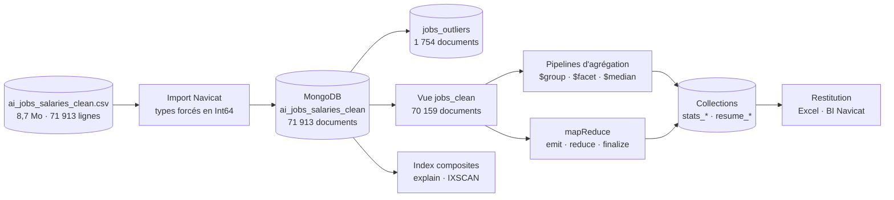

**Principe directeur :** la collection source n'est jamais altérée. Les valeurs aberrantes sont
**isolées** dans une collection dédiée plutôt que supprimées, et une **vue** `jobs_clean` sert de
point d'entrée unique à toutes les analyses, ce qui garantit que chaque chiffre publié porte
sur le même périmètre.

---

## 4. Stack technique

| Brique | Technologie | Rôle |
|---|---|---|
| Source | CSV (8,7 Mo, 17 colonnes) | Données brutes, non versionnées |
| Stockage NoSQL | MongoDB | Base orientée documents |
| Import | Navicat Premium (Import Wizard) | Chargement avec types forcés |
| Administration | Navicat Premium | Éditeur de requêtes, plans d'exécution, export |
| Traitement | Pipelines d'agrégation | `$match`, `$group`, `$facet`, `$bucket`, `$median` |
| Traitement Big Data | `mapReduce` | Implémentation du paradigme Map/Reduce |
| Contrôle croisé | Python, pandas | `analyze.py` rejoue les agrégations hors MongoDB |
| Restitution | Excel, module BI Navicat | Classeur 5 onglets, graphiques |

---

## 5. Données sources

| Source | Contenu | Format |
|---|---|---|
| Dataset public *AI Jobs & Salaries* | Offres d'emploi en données et IA, 2020-2025 : métier, salaire, devise, lieu, expérience, mode de travail | CSV, 8,7 Mo, 71 913 lignes, 17 colonnes |

Colonnes principales : `work_year`, `experience_level`, `employment_type`, `job_title`, `salary`,
`salary_currency`, `salary_in_usd`, `employee_residence`, `remote_ratio`, `company_location`,
`company_size`, plus des colonnes dérivées fournies avec le fichier (`experience_level_label`,
`work_mode`, `salary_outlier_flag`, `role_family`, `isco_group_hint`).

Le fichier n'est **pas versionné** dans ce dépôt. Pour reproduire le projet, placer le CSV dans
`data/raw/` (voir [`data/README.md`](data/README.md)).

---

## 6. Installation et exécution

### Prérequis

- MongoDB en local sur le port 27017 (version 4.4 ou antérieure pour `mapReduce` ; sinon utiliser
  les pipelines équivalents fournis)
- Navicat Premium pour l'exécution des requêtes et l'import

### Import

1. Créer une connexion MongoDB dans Navicat.
2. Clic droit sur `Collections` → **Import Wizard** → *CSV File*.
3. Forcer les types numériques en **Int64** pour `salary`, `salary_in_usd`, `work_year`, `remote_ratio`.
4. Nommer la collection `ai_jobs_salaries_clean`.

### Exécution des scripts

Les scripts de `queries/` s'exécutent dans l'éditeur de requêtes Navicat, dans l'ordre :

| Fichier | Contenu |
|---|---|
| `queries/00_decouverte.js` | Vérification de la structure et des types |
| `queries/01_nettoyage.js` | Enrichissement, isolation des extrêmes, création de la vue |
| `queries/02_agregations.js` | Analyses salariales et cadre global |
| `queries/03_mapreduce.js` | MapReduce et équivalents en pipeline |
| `queries/04_qualite.js` | Complétude, doublons, cohérence des devises |
| `queries/05_index.js` | Index composites et plans d'exécution |
| `queries/06_benchmark.js` | Chronométrage MapReduce contre pipeline d'agrégation |

### Analyse hors MongoDB

```bash
pip install -r requirements.txt
python analyze.py
```

`analyze.py` reproduit les mêmes agrégations avec pandas et écrit un classeur de cinq onglets.
Il sert de **contrôle croisé** : les chiffres produits doivent être identiques à ceux obtenus
dans Navicat, à l'unité près.

---

## 7. Étapes du projet et techniques utilisées

### 7.1 Découverte des données

Trois vérifications ont déterminé la suite du travail :

| Vérification | Constat | Conséquence |
|---|---|---|
| `typeof` sur `salary_in_usd` | `number` | Aucune conversion nécessaire |
| `typeof` sur `salary_outlier_flag` | `boolean` | Filtres directs avec `false`, sans guillemets |
| `countDocuments()` | 71 913 | Import complet, conforme au fichier source |

Cette étape a évité un nettoyage inutile : le CSV était déjà semi-préparé, avec des colonnes
dérivées et un drapeau d'outlier calculé.

### 7.2 Nettoyage et enrichissement

Trois champs calculés ont été ajoutés aux documents :

| Champ | Calcul | Usage |
|---|---|---|
| `salaire_mensuel_usd` | `salary_in_usd / 12` | Lecture plus concrète des montants |
| `cross_border` | `employee_residence ≠ company_location` | Détection des profils délocalisés |
| `salary_band` | tranches de 50 000 $ via `$switch` | Histogrammes sans `$bucket` |

### 7.3 Isolation des valeurs aberrantes

Les 1 754 lignes marquées `salary_outlier_flag: true` présentent une moyenne de **409 749 $**
(minimum 332 000 $) contre **144 696 $** pour les 70 159 autres. Elles représentent 2,4 % des
lignes mais gonflent la moyenne globale d'environ **6 000 $**.

| Impact des outliers : périmètre propre contre périmètre complet |
|---|
| 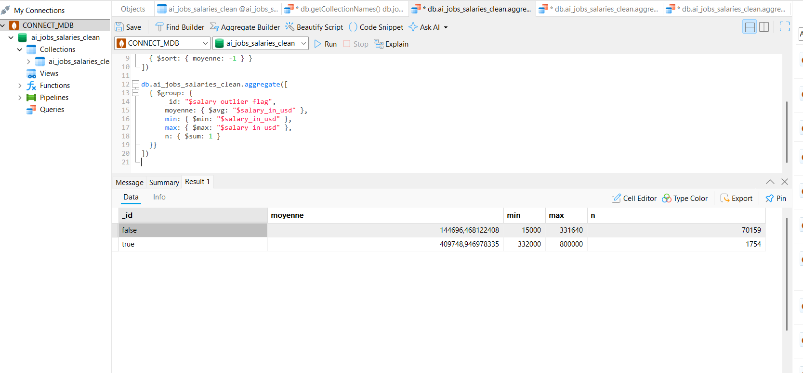 |

Elles ont été **isolées dans une collection `jobs_outliers` par un `$out`**, et non supprimées :
la source reste auditable et l'opération est réversible. Une **vue `jobs_clean`** applique ensuite
le filtre une fois pour toutes, ce qui évite de le répéter dans chaque requête.

**Ce que donne une moyenne sans ce filtre :** la requête suivante, exécutée sur la collection
complète, affiche 202 080 $ pour Executive et 167 808 $ pour Senior — soit environ 7 % de plus que
les valeurs réelles. C'est la démonstration la plus directe de l'utilité de l'étape.

| Moyenne par niveau **sans** filtre — outliers inclus |
|---|
| 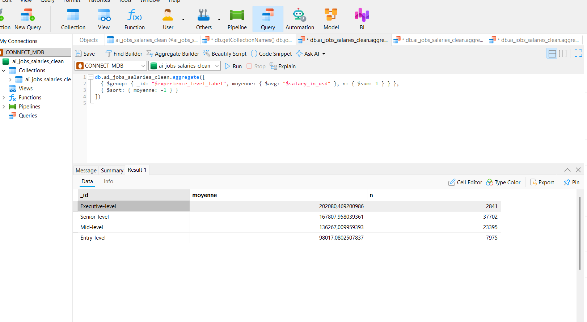 |

### 7.4 Agrégations

Un pipeline `$facet` regroupe neuf analyses en une seule exécution — volumétrie par année avec
parts en pourcentage, répartition par expérience, contrat, mode de travail, taille d'entreprise
et devise, États-Unis contre reste du monde, top 10 des pays, et indicateurs de cadrage.

| Volumétrie par année, avec part du total |
|---|
| 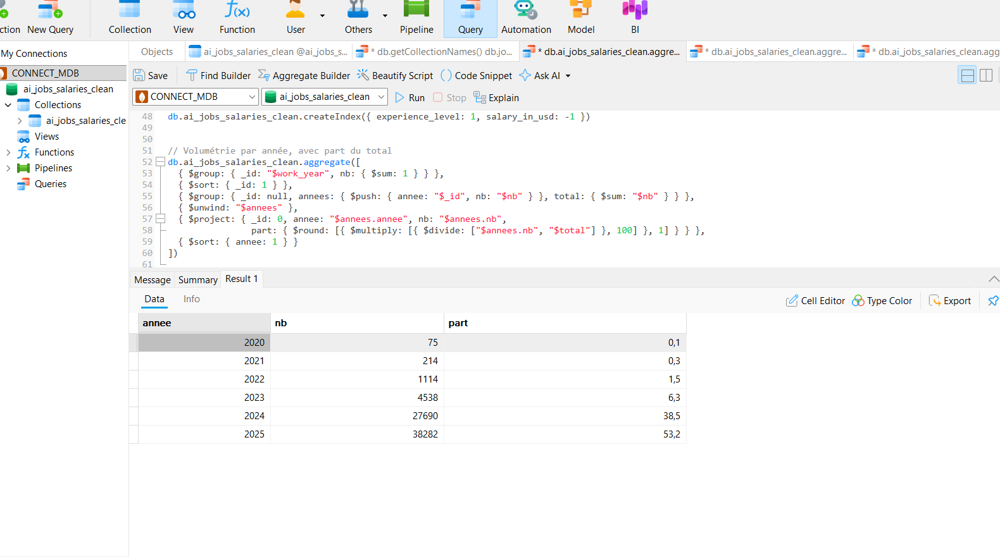 |

Enseignements : 99 % de contrats Full-time, 97,5 % d'entreprises de taille Medium, 327 offres
Hybrid seulement, et 92 % du corpus sur 2024-2025.

| Salaire moyen par année (2020-2025) | Classement des familles de métiers |
|---|---|
| 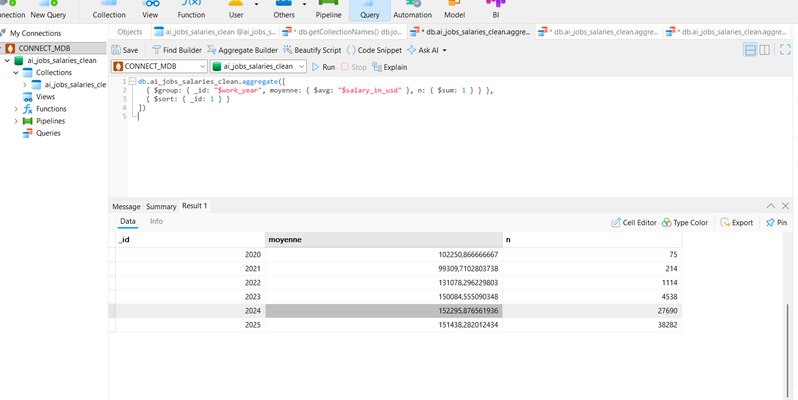 |  |

### 7.5 Analyse du télétravail : un effet qui s'inverse

Le résultat brut est contre-intuitif : Remote (145 486 $) et On-site (144 843 $) sont au coude à
coude, alors que les profils seniors sont surreprésentés en télétravail. Le croisement des deux
dimensions explique pourquoi.

| Mode de travail | Entry | Mid | Senior | Executive |
|---|---|---|---|---|
| On-site | 100 036 $ | 138 146 $ | 169 694 $ | 200 462 $ |
| Remote | 91 957 $ | 131 080 $ | 163 320 $ | 209 472 $ |
| Hybrid | 59 079 $ | 76 216 $ | 108 904 $ | 140 739 $ |

**L'écart s'inverse selon la séniorité** : à Entry et Mid, le présentiel paie davantage ; à
Executive, le télétravail l'emporte de 9 000 $. La moyenne globale — où les deux effets
s'annulent — masque donc deux dynamiques opposées. Le mode Hybrid paraît très en dessous, mais
il ne repose que sur 324 offres au total, contre 70 159 pour les deux autres : ce n'est pas un
signal exploitable.

| Mode de travail × niveau d'expérience |
|---|
| 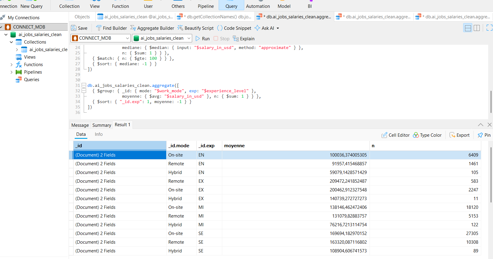 |

### 7.6 MapReduce et pipelines d'agrégation : les phases Shuffle et Reduce

Le même indicateur — salaire moyen par famille de métiers — est calculé avec les deux mécanismes
proposés par MongoDB.

**MapReduce :**

- **Map** — chaque document émet la paire `(role_family, {somme: salary_in_usd, nb: 1})` ;
- **Reduce** — additionne les sommes et les compteurs pour une même clé. La fonction renvoie
  des **sommes** et non une moyenne, car MongoDB peut l'appeler plusieurs fois sur une même clé
  (*re-reduce*) : une moyenne de moyennes serait fausse ;
- **Finalize** — calcule la moyenne une seule fois, à la fin.

```javascript
db.ai_jobs_salaries_clean.mapReduce(
  function () {
    if (this.salary_outlier_flag === true) return;
    emit(this.role_family, { somme: this.salary_in_usd, nb: 1 });
  },
  function (cle, valeurs) {
    let somme = 0, nb = 0;
    for (const v of valeurs) { somme += v.somme; nb += v.nb; }
    return { somme: somme, nb: nb };
  },
  {
    finalize: function (cle, r) { r.moyenne_usd = Math.round(r.somme / r.nb); return r; },
    out: "mr_moyenne_par_famille",
    query: { salary_outlier_flag: false }
  }
)
```

| Code MapReduce complet | Résultat dans Navicat (`{_id, value}`) |
|---|---|
| 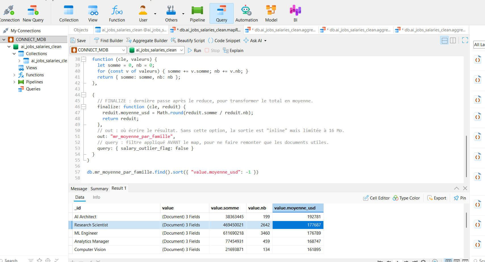 | 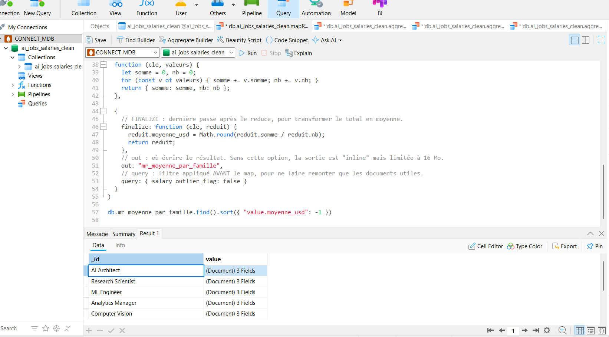 |

**Le résultat est identique** à celui du pipeline d'agrégation, valeur par valeur : AI Architect
192 781 $, Research Scientist 177 687 $, ML Engineer 176 789 $, Analytics Manager 168 747 $,
Computer Vision 161 895 $. Les deux méthodes sont donc interchangeables sur le plan du résultat.

**Ce que le MapReduce ne peut pas faire :** la **médiane**. Elle n'est pas décomposable en résultats
partiels, contrairement à une somme ou un comptage. Seul le pipeline d'agrégation la fournit, via
`$median` (MongoDB 7.0+). C'est la limite structurelle du paradigme Map/Reduce.

**Pourquoi il a été retiré :** `mapReduce` est déprécié depuis MongoDB 5.0 et **supprimé des
serveurs plus récents**. Trois raisons : il passe par un interpréteur JavaScript là où le pipeline
s'exécute en code natif ; il matérialise ses résultats intermédiaires dans une collection
temporaire ; et il est moins expressif (ni `$lookup`, ni `$setWindowFields`, ni `$facet`).

### 7.7 Requêtes et plans d'exécution

Les requêtes sont documentées dans [`docs/requetes_navicat.md`](docs/requetes_navicat.md).
Elles couvrent les filtres `find`, les agrégations par niveau et par métier, le tableau croisé
famille × expérience, les analyses géographiques et le contrôle qualité.

| Classement des pays par salaire médian |
|---|
| 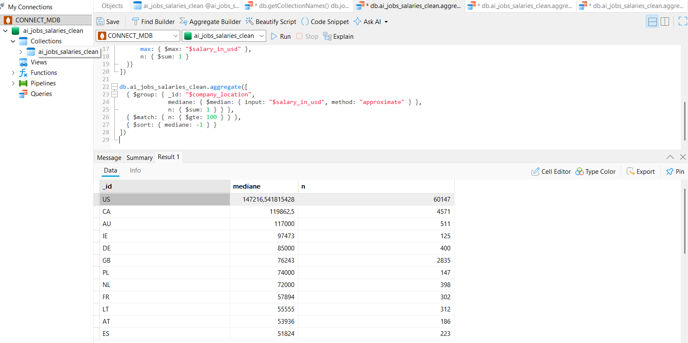 |

Trois index composites ont été créés sur les filtres les plus fréquents :

| Index | Requêtes servies |
|---|---|
| `{ role_family: 1, work_year: 1 }` | Analyses par métier et par année |
| `{ experience_level: 1, salary_in_usd: -1 }` | Classements par niveau et par salaire |
| `{ company_location: 1, salary_outlier_flag: 1 }` | Analyses géographiques filtrées |

Le plan d'exécution (`explain()`) permet de vérifier le passage de `COLLSCAN` — parcours des
71 913 documents — à `IXSCAN`, lecture ciblée par l'index.

### 7.8 Contrôle qualité

Un contrôle de doublons a été mené sur la combinaison identifiante la plus probable
(intitulé + année + salaire + pays + expérience). Il révèle des groupes allant **jusqu'à cinq
occurrences** — par exemple `Data Analyst / 2025 / 100 000 $ / US / EN`. Aucune suppression n'a
été faite : le jeu de données ne porte pas de clé métier permettant de trancher entre doublon
et offre réellement distincte.

| Groupes de doublons détectés (jusqu'à 5 occurrences) |
|---|
| 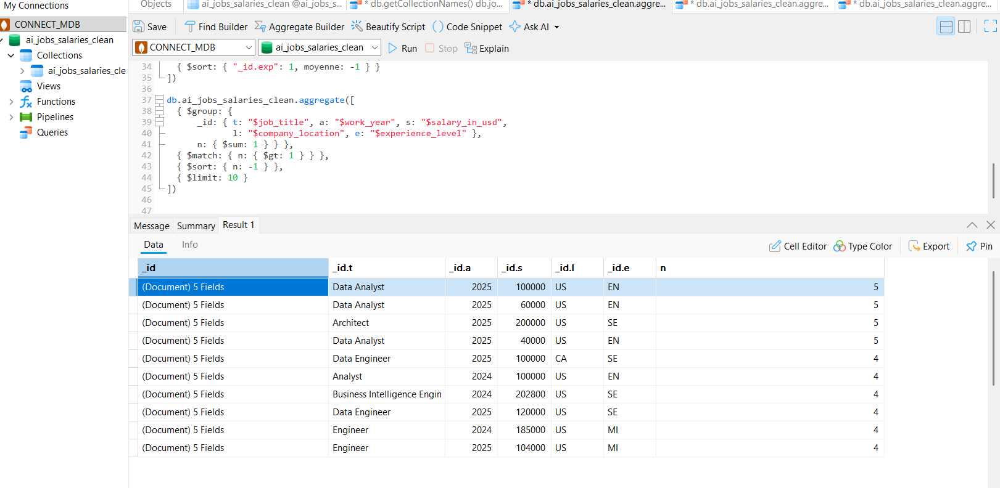 |

---

## 8. Captures d'écran

| Fichier | Contenu |
|---|---|
| `01_moyenne_par_experience.png.png` | Moyenne par niveau **sans filtre** — met en évidence l'effet des outliers |
| `02_moyenne_par_annee.png.png` | Évolution du salaire moyen de 2020 à 2025 |
| `03_mapreduce_resultat.png.png` | Résultat du MapReduce au format `{_id, value}` |
| `04_mapreduce_code.png.png` | Code MapReduce complet : `emit`, `reduce`, `finalize`, `out`, `query` |
| `05_classement_metiers.png.png` | Classement des familles de métiers par salaire moyen |
| `06_impact_outliers.png.png` | Écart entre périmètre propre (144 696 $) et périmètre complet (409 749 $) |
| `07_mode_par_niveau.png.png` | Croisement mode de travail × niveau d'expérience |
| `08_classement_pays.png.png` | Salaire médian par pays, au moins 100 offres |
| `09_doublons.png.png` | Groupes de doublons sur la combinaison identifiante |
| `10_volume_par_annee.png.png` | Volumétrie et part de chaque année |

---

## 9. Limites et perspectives

**Cinq limites structurelles à connaître avant d'interpréter les chiffres :**

**Le corpus est massivement américain** — 60 147 offres sur 71 913, soit 83,6 %. Tout classement
par pays compare donc surtout des marchés au marché américain, et les salaires ne sont pas
corrigés des différences de coût de la vie.

**La famille `Other / Unclassified` représente 56 % des lignes.** Les comparaisons par métier
ne portent donc que sur les 44 % restants. Le classement est robuste sur les familles à fort
volume (Data Scientist 7 102, Data Engineer 7 168, Data Analyst 8 313) mais fragile sur les
petites : AI Architect ne compte que 199 offres, Computer Vision 134.

**Les années 2020-2022 comptent très peu d'offres** (75 à 1 114 par an). Toute tendance
temporelle avant 2023 repose sur un échantillon trop faible pour être concluante ; les analyses
par année filtrent à partir de 2023.

**Aucune clé métier ni information sur l'origine des lignes.** Le contrôle de doublons montre des
groupes allant jusqu'à cinq occurrences identiques, sans qu'on puisse savoir s'il s'agit de la
même offre comptée plusieurs fois ou d'offres distinctes. Les volumes doivent donc être lus comme
des ordres de grandeur.

**Le mode Hybrid n'est pas exploitable statistiquement** — 324 offres sur 70 159, soit 0,5 %.
Ses moyennes apparaissent très basses, mais l'échantillon est trop mince pour conclure quoi que
ce soit sur ce mode de travail.

**Perspectives :** corriger les salaires du coût de la vie local (parité de pouvoir d'achat) pour
rendre la comparaison internationale pertinente ; croiser avec des données d'entreprise pour
tester l'effet taille sur le salaire, aujourd'hui neutralisé par la prédominance des entreprises
de taille Medium ; et modéliser le salaire par régression pour isoler l'effet propre de chaque
variable, plutôt que de lire des moyennes marginales — c'est la méthode qui permettrait de
trancher proprement la question du télétravail.

---

## 10. Structure du dépôt

```
ai-jobs-salaries/
├── README.md                       ← ce fichier
├── CHANGELOG.md
├── SECURITY.md
├── .gitignore
├── analyze.py                      ← analyse hors MongoDB (contrôle croisé)
├── requirements.txt
├── data/
│   └── README.md                   ← source, colonnes et licence du jeu de données
├── docs/
│   └── requetes_navicat.md         ← requêtes Q01 à Q09 commentées
├── queries/
│   ├── 00_decouverte.js
│   ├── 01_nettoyage.js
│   ├── 02_agregations.js
│   ├── 03_mapreduce.js
│   ├── 04_qualite.js
│   ├── 05_index.js
│   └── 06_benchmark.js
├── reports/
│   └── analyse-ai-jobs-salaries.xlsx
└── screenshots/
    └── 01_… à 10_… (.png)
```

---

*Projet réalisé avec MongoDB et Navicat Premium. Les données brutes ne sont pas versionnées.*
